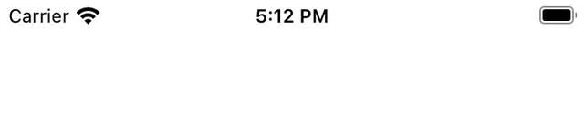
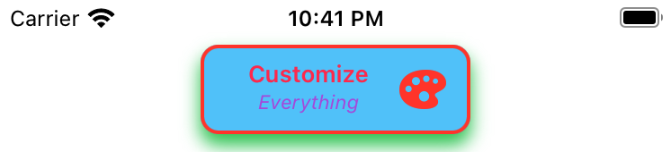

# Toasty 🔥🍞🔥
 

## Preview
| iOS system | Toasty |
|----------|----------|
|  |  |
|  |  |

## Features
- [x] Easy to implement.
- [x] Highly customizable. 
- [x] Dark Mode support. 🌓
- [x] 60FPS smooth animations. 
- [x] Interactive expanded view support.
- [x] Top or bottom position support.
- [x] Icon support. 

| Icon support | Customization | Update transition |
|----------|----------|----------|
|  |  |  |

### Interaction example

## Documentation
You can find [the docs here](http://shadow-of-arman.github.io/Toasty/). Documentation is generated with [jazzy](https://github.com/realm/jazzy) and hosted on [GitHub-Pages](https://pages.github.com).

## Community

- Found a bug? Open an [issue](https://github.com/shadow-of-arman/Toasty/issues).
- Feature idea? Open an [issue](https://github.com/shadow-of-arman/Toasty/issues).
- Want to contribute? Submit a [pull request](https://github.com/shadow-of-arman/Toasty/pulls).

## Resources

* [Swift Evolution](https://github.com/apple/swift-evolution)

## License

Toasty is available under the MIT license, see the [LICENSE](https://github.com/shadow-of-arman/Toasty/blob/master/LICENSE) file for more information.