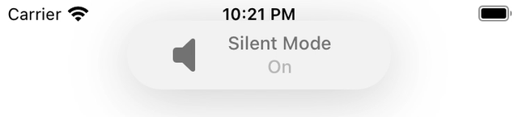

# Toasty 🔥🍞🔥
[](http://shadow-of-arman.github.io/Toasty/) 
[](https://developer.apple.com/swift)
[](https://github.com/shadow-of-arman/Toasty/blob/master/LICENSE)

## Preview
| iOS system | Toasty |
|----------|----------|
|  |  |
|  |  |


## Features
- [x] Easy to implement.
- [x] Highly customizable. 
- [x] Dark Mode support. 🌓
- [x] 60FPS smooth animations. 
- [x] Interactive expanded view support.
- [x] Top or bottom position support.
- [x] Icon support. 

| Icon support | Customization | Update transition |
|----------|----------|----------|
|  |  |  |

### Interaction example


## Instalation

### CocoaPods

[CocoaPods](http://cocoapods.org) is a dependency manager for Cocoa projects. You can install it with the following command:


```bash
$ gem install cocoapods
```

To integrate Toasty into your Xcode project using CocoaPods, specify it in your `Podfile`:

```ruby
source 'https://github.com/CocoaPods/Specs.git'
platform :ios, '11.0'
use_frameworks!

pod 'SideMenu', '~> 1.0'
```

Then, run the following command:

```bash
$ pod install
```

### Carthage

`Coming soon!`

### Swift Package Manager

`Coming soon!`

### Manual

If you prefer not to use either of the aforementioned dependency managers, you can integrate sources in the `Toasty` folder into your project manually.

## Usage

You can get started by creating an instance of toasty and preparing it before you want to use it. Just make sure to prepare the toast when your `ViewController` has entered a view hierarchy. (anything after viewDidAppear)

```Swift
import Toasty

class ViewController: UIViewController {

    let toast = Toasty()
	

    override func viewDidLoad() {
        super.viewDidLoad()
        self.createUI()
    }

    override func viewDidAppear(_ animated: Bool) {
        super.viewDidAppear(animated)
        self.toast.prepareToast(title: "Toasty!")
    }

}

```

Then all you need is to use the `show` function to show your toast!

```Swift
self.toast.show(from: .top)
//or 
self.toast.show(from: .bottom)
```

By default your toast will hide/dismiss automatically, but you can also do it manually.

```Swift
toast.show(from: .top, autoDismiss: false)
//then hide it by using
toast.hide()
//or
toast.dismiss()
```
`hide()` and `dismiss()` both do the exact same thing.

### Costumization

There is a lot of code documentation in the project and you can use quick help to access these when ever you want. 

For now you will have to use the in code documentation untill I update this README soon.

## Documentation
You can find [the docs here](http://shadow-of-arman.github.io/Toasty/). Documentation is generated with [jazzy](https://github.com/realm/jazzy) and hosted on [GitHub-Pages](https://pages.github.com).

## Community

- Found a bug? Open an [issue](https://github.com/shadow-of-arman/Toasty/issues).
- Feature idea? Open an [issue](https://github.com/shadow-of-arman/Toasty/issues).
- Want to contribute? Submit a [pull request](https://github.com/shadow-of-arman/Toasty/pulls).

## Resources

* [Swift Evolution](https://github.com/apple/swift-evolution)

## License

Toasty is available under the MIT license, see the [LICENSE](https://github.com/shadow-of-arman/Toasty/blob/master/LICENSE) file for more information.
